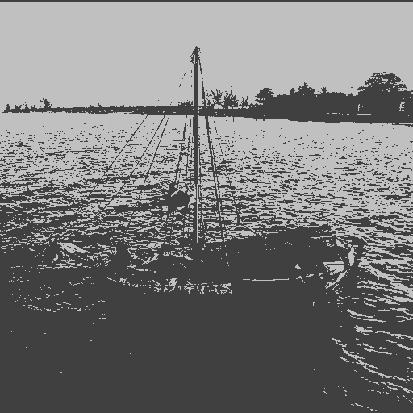
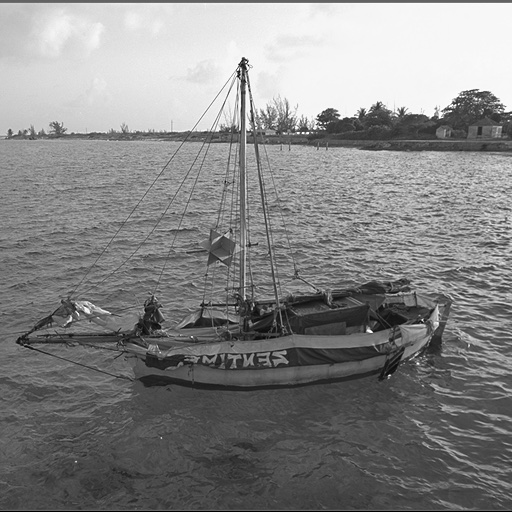
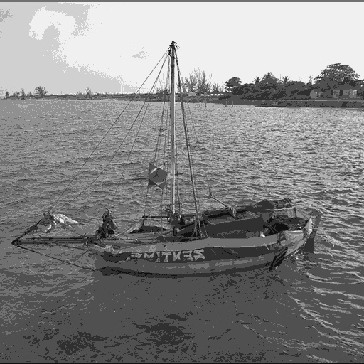
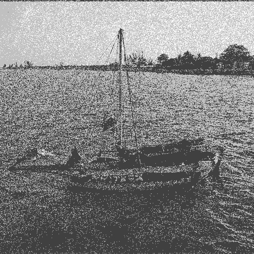
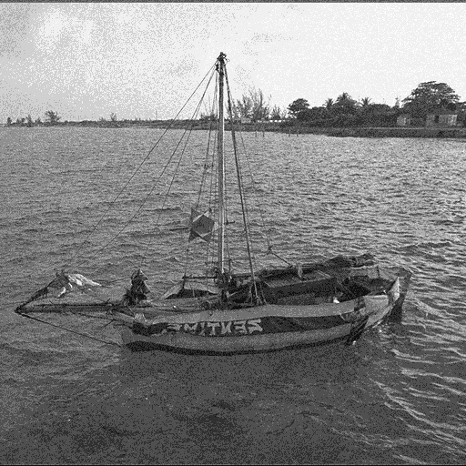
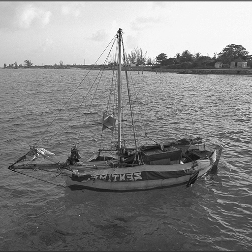

# 
 Explanations regarding output images

## 0. How to compile

`gcc -Wall -O2 -o quantisation quantisation.c -lm`

## 1. Quantization formula

### 1.1 Formula without noise

$$
u_{i,j} = (\bigg\lfloor \frac{u_{i,j}}{d} \bigg\rfloor + {1 \over 2}) \cdot d
$$

### 1.2 Formula with noise

$$
u_{i,j} = (\bigg\lfloor \frac{u_{i,j}}{d} + n_{i,j} \bigg\rfloor + {1 \over 2}) \cdot d
$$

## 2.1 Explanations

## 2.1 problem (a)

### 2.1.1 q = 1

According to the quantization formula, pixel values smaller than 128 are mapped to 64, those bigger than 128 are then mapped to 192.

### 2.1.2 q = 3

As mentioned in the lecture, humans can distinguish 40 shades of grey. If we quantify the image with q = 3, we can see the white block in the sky and black block in the sea.

### 2.1.3 q = 6

We can not tell the visual difference between the original image and the image quantified with q = 6.

## 2.2 Problem (b)

### 2.2.1 q = 1

As we can see in the compared images, the noise looks like impulse noise.

Cause in this case, bright pixels in the sky can be only affected by salt noise. The pixel value in the sky area is around 220, even if disturbed by the minimum noise -0.5, it is still bigger than 1, so it will be mapped to 192, but when it is affected by a positive noise, it is possible that it goes over the maximum value 255 and can be cropped.

Same in the shadow area of the boat, which is the bottom part of the image, but it is also only degraded by positive noise, cause in this area negative noise is cropped.

The most sea zone is affected by both salt and pepper noise.

### 2.2.2 q = 3

A zero mean and maximal deviation of 0.5 uniform noise is quit a large one if the image is only represented by 3 bits. It does look like a quit large noise in the degraded image.

### 2.2.3 q = 6

The mentioned noise becomes really small compared with a image represented by 6 bits, thus we can hardly see the difference between the noisy image and the quantified image.

## 2.3 Comparison of statistics

|               | mean of image| standard deviation | mean of noise |
|-------------- | ------------ | ------------------ | ------------- |
|    original   |    133.72    |      64.30         |       /       |
|q = 1 no noise |    122.07    |      63.72         |       /       |
|q = 3 no noise |    134.18    |      63.57         |       /      |
|q = 6 no noise |    137.73    |      64.29         |       /       |
|q = 1 noisy    |    134.56    |      79.95         |   0.000601    |
|q = 3 noisy    |    133.27    |      65.51         |   0.000493    |
|q = 6 noisy    |    133.22    |      64.32         |  -0.000469    |